# Smart repository import and realtime operations

## Summary

Add a revision-specific repository discovery layer that normalizes supported manifests and conventional project files into one reviewable RailDock topology. Apply that topology through the existing manifest reconciler, then consolidate operational state around one realtime event/cache contract and a simplified service panel.

---

## Requirements

- R1-R9. Discover, translate, explain, review, override, and apply repository topology without flattening multi-service inputs.
- R9a. Keep the default flow understandable without manifest, builder, or Dokku knowledge; technical provenance is progressive disclosure.
- R10-R14. Make operational updates sequenced, durable, reconnectable, and credential-safe.
- R15-R18. Consolidate the service panel and validate/install builder capabilities before deployment.

**Origin actors:** A1 platform operator, A2 discovery pipeline, A3 deployment runtime  
**Origin flows:** F1 repository discovery, F2 topology apply, F3 observe and recover  
**Origin acceptance examples:** AE1-AE6

---

## Scope Boundaries

- Translate supported manifests without emulating proprietary provider infrastructure.
- Reject or warn on lossy mappings instead of guessing.
- Redesign the service operational panel, not global navigation.
- Keep sampled metrics on polling; realtime is for state transitions and operational feeds.

---

## Context & Research

### Relevant Code and Patterns

- `backend/app/services/manifest_parser.rb` already normalizes RailDock, Railway, and app.json inputs.
- `backend/app/services/manifest_reconciler.rb` is the canonical apply boundary.
- `backend/app/services/github_app_service.rb` already owns installation-authenticated repository access.
- `backend/app/jobs/deployment_job.rb` streams Dokku output through `DeploymentsChannel` but persists and broadcasts unredacted chunks.
- `app/src/hooks/useWebSocketDeployments.ts` invalidates list state but not deployment detail state, while subscriptions are mounted independently by tabs.

### External References

- Railway automatically uses an existing Dockerfile and otherwise uses Railpack zero-config detection.
- Dokku requires separate Railpack, BuildKit, Nixpacks, and Pack host capabilities.
- Dokku `git:sync` does not build unless explicitly requested; `ps:rebuild` is the live build boundary in the current flow.

---

## Key Technical Decisions

- Discovery snapshots are keyed to repository, branch, and commit SHA; apply accepts the reviewed canonical snapshot rather than re-discovering mutable branch state.
- Native RailDock manifests win. Otherwise all foreign manifests under candidate roots are normalized and composed; conventional detection fills only missing fields.
- Provenance and warnings travel alongside canonical service data but do not pollute the persisted RailDock manifest format.
- A project-level realtime channel owns service/deployment/activity/manifest invalidation; deployment channels remain optimized for ordered log chunks.
- Log redaction happens before persistence and broadcast, with API serialization as defense in depth.

---

## High-Level Technical Design

> *Directional guidance for review, not implementation specification.*

```mermaid
flowchart LR
  Repo["Repository + branch"] --> Snapshot["Tree + commit snapshot"]
  Snapshot --> Discover["Manifest and convention discovery"]
  Discover --> Normalize["Canonical RailDock desired state"]
  Normalize --> Review["Topology review + provenance"]
  Review --> Apply["Manifest reconciler"]
  Apply --> Events["Durable operation events"]
  Events --> Cache["Realtime cache updates + fallback reconcile"]
  Cache --> Panel["Service operational workspace"]
```

---

## Implementation Units

### U1. Repository discovery and canonical composition

**Goal:** Inspect GitHub repository trees at a fixed revision and compose native, foreign, and conventional evidence into one canonical topology.

**Requirements:** R1-R5, R8; F1; AE1-AE3

**Dependencies:** Existing manifest parsers

**Files:**
- Create: `backend/app/services/repository_discovery.rb`
- Modify: `backend/app/services/github_app_service.rb`, `backend/app/services/manifest_parser.rb`
- Test: `backend/spec/services/repository_discovery_spec.rb`

**Approach:** Native manifest authority; multi-root foreign manifest composition; Dockerfile/Procfile/runtime fallback; provenance, confidence, warnings, and immutable commit SHA.

**Test scenarios:** Native authority, multiple Railway roots, app.json hooks, Dockerfile-only fallback, conflicting manifests, unsupported fields, inaccessible revision.

**Verification:** The TerraVest repository resolves to Dockerfile from its Railway declaration, not a guessed Nixpacks/Railpack service.

### U2. Discovery and apply API

**Goal:** Expose preview and reviewed-snapshot application without creating partial resources.

**Requirements:** R5-R9; F2; AE1-AE3

**Dependencies:** U1

**Files:**
- Create: `backend/app/controllers/api/repository_imports_controller.rb`
- Modify: `backend/config/routes.rb`
- Test: `backend/spec/requests/api/repository_imports_spec.rb`

**Approach:** Authorize project/Git source, return canonical topology and snapshot token, validate commit and overrides on apply, persist canonical RailDock manifest, queue existing apply job.

**Test scenarios:** Preview, apply unchanged SHA, reject tampered snapshot, authorization, provider failure, conflicting topology.

**Verification:** One API flow handles both single-service and multi-service imports.

### U3. Builder capability guarantees and preflight

**Goal:** Install supported host prerequisites and fail incompatible overrides before building.

**Requirements:** R9, R18; AE3

**Dependencies:** None

**Files:**
- Modify: `install.sh`, `backend/app/services/host_engine.rb`, `backend/app/jobs/deployment_job.rb`, `backend/app/controllers/api/builders_controller.rb`
- Test: `backend/spec/jobs/deployment_job_spec.rb`, `backend/spec/requests/api/builders_spec.rb`

**Approach:** Idempotently install/configure Railpack+BuildKit and report server-scoped capability; deployment preflight checks external builder binaries/daemons.

**Test scenarios:** Available Dockerfile, missing Railpack, healthy Railpack/BuildKit, installer idempotency surface, actionable preflight failure.

**Verification:** Missing tools fail before source build and install/update makes advertised builders usable.

### U4. Ordered realtime and secret-safe logs

**Goal:** Make deployment events update cache deterministically and prevent credentials from entering logs.

**Requirements:** R10-R14; F3; AE4-AE5

**Dependencies:** None

**Files:**
- Create: `backend/app/services/log_redactor.rb`, `backend/app/channels/project_channel.rb`, `app/src/hooks/useProjectRealtime.ts`
- Modify: `backend/app/jobs/deployment_job.rb`, `backend/app/jobs/restart_job.rb`, `backend/app/models/deployment.rb`, `app/src/hooks/useWebSocketDeployments.ts`, `app/src/hooks/useServices.ts`, `app/src/pages/ProjectCanvas.tsx`
- Test: `backend/spec/services/log_redactor_spec.rb`, `backend/spec/jobs/deployment_job_spec.rb`, `app/src/__tests__/websocket.test.tsx`

**Approach:** Redact at ingestion, sequence chunks, patch deployment detail/list/service caches directly, invalidate on gaps, reconnect with bounded polling fallback, subscribe once at project/service-panel scope.

**Test scenarios:** Credential URLs, mid-stream join, ordered chunks, duplicate/out-of-order chunks, reconnect gap, status updates outside Deployments tab.

**Verification:** Open logs append without collapse/remount and no API/websocket payload contains tokens.

### U5. Smart creation flow

**Goal:** Replace up-front builder choice with source discovery and topology review.

**Requirements:** R6-R9; F1-F2; AE1-AE3

**Dependencies:** U1, U2, U3

**Files:**
- Modify: `app/src/pages/AddServiceModal.tsx`, `app/src/lib/api.ts`, `app/src/types/index.ts`
- Test: `app/src/__tests__/components.test.tsx`

**Approach:** Source → scanning → plain-language topology review → apply; show technical provenance and warnings only on demand; advanced per-service overrides; preserve Docker-image and manual service paths.

**Test scenarios:** Multi-service review, Dockerfile recommendation, no-manifest fallback, conflicts, capability warning, apply progress and error recovery.

**Verification:** Operators never choose a builder before discovery for connected repositories.

### U6. Service panel consolidation

**Goal:** Remove duplicated status/actions/subscriptions and make live deployment state legible on every tab.

**Requirements:** R12-R13, R15-R17; AE4, AE6

**Dependencies:** U4

**Files:**
- Modify: `app/src/pages/ServicePanel.tsx`, `app/src/features/service-panel/tabs/OverviewTab.tsx`, `app/src/features/service-panel/tabs/DeployTab.tsx`
- Test: `app/src/__tests__/components.test.tsx`, `app/src/__tests__/websocket.test.tsx`

**Approach:** Shared operational header; overview focuses on health/dependencies; deployments owns history/logs; one subscription owner; explicit live/reconnecting/fallback state; scroll-follow pause.

**Test scenarios:** Tab switching without resubscribe, one action set, active deployment visibility, scroll pause/resume, reconnect indicator, consistent status.

**Verification:** No duplicated lifecycle controls or contradictory state across panel tabs.

---

## System-Wide Impact

- **Interaction graph:** Git provider → discovery → canonical manifest → reconciler → deployments → project/deployment channels → query cache → panel/canvas.
- **Error propagation:** Discovery conflicts block apply; capability errors block builds; realtime gaps trigger snapshot reconciliation.
- **State lifecycle risks:** Branch movement, duplicate events, partial applies, stale caches, and secret-bearing subprocess output require explicit guards.
- **Integration coverage:** Request specs cover discovery/apply; job specs cover builder/log boundaries; frontend tests cover cache and panel behavior.

---

## Risks & Dependencies

| Risk | Mitigation |
|---|---|
| Foreign manifests cannot express complete project topology | Compose multiple rooted manifests and surface provenance/loss warnings rather than pretending parity. |
| GitHub tree APIs truncate very large repositories | Detect truncation and fall back to targeted content fetches or a clear error. |
| Live event storms overload persistence/network | Batch durable log persistence and patch client caches without refetching per chunk. |
| Existing servers lack new builder tools | Idempotent update installer plus server-scoped capability reporting. |

---

## Documentation / Operational Notes

- Update `AGENTS.md` and install guidance for builder capabilities and repository discovery precedence.
- Recommend rotating any credential observed in historical deployment logs; new logs are redacted prospectively.

---

## Sources & References

- **Origin document:** [docs/brainstorms/2026-06-20-smart-import-realtime-operations-requirements.md](../brainstorms/2026-06-20-smart-import-realtime-operations-requirements.md)
- [Railway builds](https://docs.railway.com/builds)
- [Dokku Railpack](https://dokku.com/docs/deployment/builders/railpack/)
- [Dokku Git deployment](https://dokku.com/docs/deployment/methods/git/)
